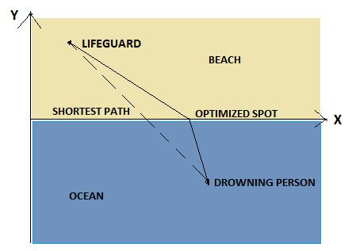

# Lifeguard Prob

## Problem Description
- A life guard is sitting on a beach on a lookout for potential emergencies.
- He suddenly notices a person who is drowning and springs to action.
- He runs up to the sea with a **speed `f*V` km/hr**, then he swims straight to the person at the **rate `V` km/hr** (*both in straight lines* and where `f` is a **multiplying factor** as humans run much faster than they can swim).
- He wants to minimize the time taken to get to that person.
- See the below image for better understanding :
- 
- 
- Since the lifeguard **runs faster**, it will save some more time to run a longer distance rather than going straight and thus swimming a long distance.
- However, this comes with the trade-off that running longer can actually mean going a longer distance thus taking more time.
- Thus, it can be logically inferred that, there must exist a spot on the Beach-Sea Interface where, if the lifeguard directly runs to from his starting location, and then swims directly to the drowning person, it'll take the least time.
- Given the starting location , the location of the drowning person and the multiplying factor `f`, find the optimized spot for fastest time.

### Assumptions/Problem Explanation:
1. Consider that everything is in a two dimensional (2D) plane.
    - The x axis represents the Beach-Sea interface, positive Y axis is towards land and negative Y-axis towards sea (See image above).
2. The Y-axis along with origin is at some arbitrary location to the **left of both** the lifeguard and the drowning person.
    - Since the origin point remains the same for both of them and the staring locations are given relative to the origin , its actual location does not matter.
    - The only thing to note is, the origin and Y axis is to the left of both of them, so beach is always in 1st quadrant and sea in 4th.
    - Thus, the positions of lifeguard and the drowning person are given as their `(x,y)` co-ordinates. `(7,5)` means the person is 7 units on the axis and 5 units on the positive y axis, and hence on the beach.
    - Similarly, (7,-5) means the person is 7 units on the axis and 5 units on the negative Y axis, and hence in sea.
3. The lifeguard both runs and swims in perfectly straight lines.
4. With regards to everything explained above, your task is to **find a point on the Beach-Sea Interface `(X -axis)` `(x_optimized,0)` to where if the lifeguard runs directly from his starting position and then swims directly from the point to the drowning person, it'll take the least amount of time.**
5. All calculations must be done **upto 6 decimal points accuracy** and the output must be upto 6 decimal points as well.

## Constraints
- 0 <= x_l < 100 (Integer)
- 0 <= y_l < 100 (Integer)
- 0 <= x_w < 100 (Integer)
- -500 < y_w < 0 (Integer)
- 1 < f <= 15 (Integer)

## Input Format
- The input shall consist of 3 parameters :
    1. Starting position of the lifeguard in terms of his coordinates (x_l,y_l).
    2. Position of the drowning person (x_w,y_w)
    3. The multiplying factor f.
- These parameters would be given in the following order in 5 different lines:
    x_l  
    y_l  
    x_w  
    y_w  
    f  

## Output
- Output must be a single number, x_optimized, as described above. The output must be having accuracy to 6 decimal places. That is, 1 should be represented as 1.000000

## Timeout
- 1

## Test Case
### Example 1

#### Input
1  
1  
1  
-1  
1.2  

#### Output
1.000000  
